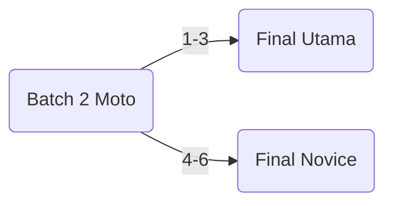
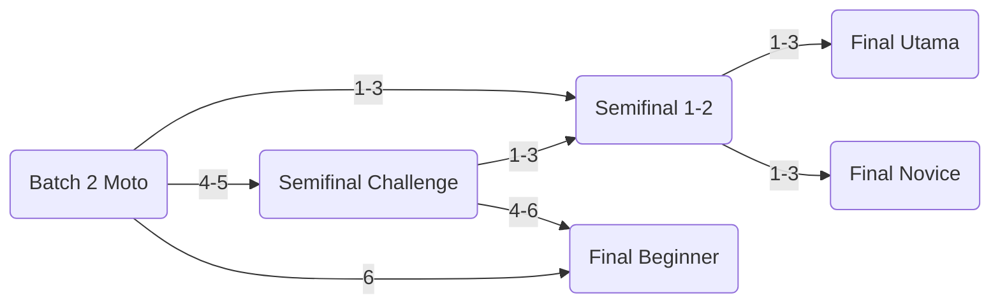

## 2 Batch

```mermaid
flowchart LR
A(Batch 2 Moto) -->|1-3| B(Final Utama)
A(Batch 2 Moto) -->|4-6| C(Final Novice)
```

## 3 Batch

```mermaid
flowchart LR
A(Batch 2 Moto) -->|1-3| B(Semifinal 1-2)
A(Batch 2 Moto) -->|4-5| C(Semifinal Challenge)
C(Semifinal Challenge) -->|1-3| B(Semifinal 1-2)
B(Semifinal 1-2) -->|1-3| D(Final Utama)
B(Semifinal 1-2) --> |1-3| E(Final Novice)
C(Semifinal Challenge) --> |4-6| F(Final Beginner)
A(Batch 2 Moto)--> |6| F(Final Beginner)
```
