# 📘 Panduan Race Director - Pushbike Lampung Academy

## ⚙️ Regulasi Sepeda

1. Sepeda yang digunakan adalah sepeda pushbike/balance bike dengan ukuran roda 12 inch.
2. Panjang handlebar maksimal 48 cm dan wajib menggunakan bar end karet/plastik.
3. Wajib menggunakan stem protector demi keamanan rider.
4. Dilarang menambah rem dan lampu yang dapat mengganggu jalannya perlombaan dan membahayakan peserta lainnya.

---

## 🧒 Regulasi Riders

1. Race berdasarkan tahun lahir sesuai gender (2023: kategori mix).
2. Wajib menggunakan helm dengan tali dikaitkan. Pelanggaran: penalty poin +3.
3. Wajib memakai sepatu dan kaos kaki saat start. Pelanggaran: +3 poin.
4. Dilarang menggunakan ornamen lampu di helm, sepatu, atau jersey. Pelanggaran: +3 poin.
5. Disarankan menggunakan sarung tangan, knee dan elbow protector.
6. Wajib memakai number plate saat registrasi. Jika tidak: DNS (Did Not Start).
7. Harus sesuai kelas umur atau naik kelas, dilarang turun kelas atau manipulasi data umur. Pelanggaran: diskualifikasi permanen dari seluruh event.

---

## 👨‍👩‍👧 Regulasi Wali Riders

1. Wali tidak boleh masuk area track/area steril kecuali atas izin Race Director. Pelanggaran: +8 poin.
2. Harus berjarak minimal 1,5 m dari rider saat start, dilarang menyentuh. Pelanggaran: +3 poin.
3. Dilarang masuk area finish. Pelanggaran: +8 poin.
4. Hanya 1 wali atau pelatih yang diperkenankan bantu di waiting zone (kecuali kategori 2020 – FFA: dilarang masuk).
5. Dilarang menggunakan alat komunikasi/properti pengganggu konsentrasi. Pelanggaran: +8 poin.
6. Dilarang merokok (termasuk vape) di luar area merokok. Pelanggaran: diskualifikasi.
7. Wali wajib menjaga etika dan kebersihan. Pelanggaran: diskualifikasi.

---

## 🏁 Regulasi Perlombaan

### 🚲 Umum

1. Dilarang menambah alat perekam di sepeda/helm/tubuh rider.
2. Dokumentasi pribadi hanya di luar track.
3. Race memakai 8 line gate start.
4. Perhitungan poin sistem poin terendah:
   - P1 = 1 poin
   - P2 = 2 poin
   - dst.
5. Kelas 1 grup: main 3x moto → juara berdasarkan kalkulasi poin (jika sama, lihat finish moto terakhir).
6. Kelas 2 grup: main 2x moto:
   - P1–P4 → Final Grand Champion
   - P5–P8 → Final Champion

### 🔢 Grup 3–8 dan Perhitungan Klasemen

- Grup 3–8 memiliki sistem lebih kompleks. Setiap grup dibagi ke dalam babak-babak seperti:
  - Semifinal
  - Final Champion
  - Final Pro
  - Final Novice
  - Final Rookie
  - Final Beginner
  - Final Amateur
  - Final Newbie
  - Quarter Final
  - Kualifikasi
- Detail sistem klasifikasi dan pembagian grup sudah ditentukan berdasarkan posisi finish masing-masing moto.

### 🏆 Sistem Klasemen Series

- Jika event dibuat dalam bentuk series:
  - P1 = 25 poin
  - P2 = 22 poin
  - ... hingga P8 = 15 poin, dan seterusnya menyesuaikan tiap kelas
  - Kategori klasemen: Grand Champion, Champion, Pro, Novice, Rookie, Beginner, Amateur, Newbie

---

## 🚦 Aturan Tambahan Perlombaan

14. Maks. 8 rider per grup, 8 finalis tiap kelas.
15. Jika poin sama, lihat hasil finish terakhir.
16. Panggilan start 3x. Tidak datang: DNS +8 poin.
17. Tidak menyelesaikan race = DNF +8 poin.
18. Dilarang melakukan jump start. Pelanggaran: +8 poin.
19. Jika ½ rider jatuh sebelum garis merah saat start: race bisa diulang 1x.
20. Dilarang overtake membahayakan (menyudutkan, tabrakan). Pelanggaran: +8 poin.
21. Manuver berbahaya (tabrak disengaja, pengereman mendadak): +8 poin.
22. Dilarang shortcut lintasan. Pelanggaran: +4 poin.
23. Keberatan hanya diterima dengan bukti video yang jelas.
24. Marshall menjaga keamanan, membantu rider jatuh setelah dilewati rider lain.
25. Jika aman, Marshall boleh langsung bantu rider jatuh.
26. Marshall boleh hentikan start jika track dinilai tidak aman.
27. Marshall hanya menyentuh rider dalam kondisi tidak aman/tidak bisa bangun sendiri.
28. Finish bersamaan: ditentukan lewat video (roda depan).
29. Force majeure: Race Director berhak hentikan race dan musyawarah dengan peserta.
30. Keberatan wajib disampaikan sebelum race selanjutnya dimulai, disertai video.
31. Rider wajib hadir 90 menit sebelum race. Jika race dipercepat dan rider tidak hadir setelah dipanggil 3x: DNS atau +8 poin.
32. Kelas Baby Rider (umur 1–2 tahun): 1 wali boleh masuk track (tanpa sentuhan dan tidak ganggu jalur).

---

## 📊 1 Grup

```mermaid
flowchart TD
  A1(Moto 1-3)
  A2{Kalkulasi Poin}
  A3(Penentuan Juara 1–8)
  A1 --> A2 --> A3
```

---

## 📊 2 Grup

```mermaid
flowchart TD
  B1(Moto 1-2)
  B2a(P1-P4 → Final Grand Champion)
  B2b(P5-P8 → Final Champion)
  B1 --> B2a
  B1 --> B2b
```

---

## 📊 3 Grup

---

## 📊 4 Grup

```mermaid
flowchart TD
  D1(Moto 1-2)
  D2a(P1-P4 → Semifinal)
  D2b(P5-P6 → Final Pro)
  D2c(P7-P8 → Final Novice)
  D3a(P1-P4 Semifinal → Final Grand Champion)
  D3b(P5-P6 Semifinal → Final Champion)
  D1 --> D2a --> D3a
  D2a --> D3b
  D1 --> D2b
  D1 --> D2c
```

---

## 📊 5 Grup

---

## 📊 6 Grup

```mermaid
flowchart TD
  F1(Moto 1-2)
  F2a(P1-P2 → Semifinal)
  F2b(P3-P4 → Quarter Final)
  F2c(P5-P6 → Kualifikasi ke Quarter)
  F2d(P7 → Kualifikasi ke Final Rookie)
  F2e(P8 → Final Beginner)
  F3a(P1-P2 Q-Kualifikasi → Quarter)
  F3b(P3-P4 Q-Kualifikasi → Final Novice)
  F3c(P5-P6 Q-Kualifikasi → Final Rookie)
  F4a(P1-P4 Rookie-Kualifikasi → Final Rookie)
  F4b(P5-P6 Rookie-Kualifikasi → Final Beginner)
  F5a(P1-P2 Quarter → Semifinal)
  F5b(P3-P6 Quarter → Final Pro)
  F5c(P7-P8 Quarter → Final Novice)
  F6a(P1-P4 Semifinal → Final Grand Champion)
  F6b(P5-P6 Semifinal → Final Champion)
  F1 --> F2a --> F6a
  F2a --> F6b
  F1 --> F2b --> F5a --> F6a
  F5a --> F6b
  F2b --> F5b
  F2b --> F5c
  F1 --> F2c --> F3a --> F5a
  F2c --> F3b --> F5c
  F2c --> F3c --> F4a --> F5b
  F4a --> F5c
  F1 --> F2d --> F4b
  F1 --> F2e
```

---

## 📊 7 Grup

```mermaid
flowchart TD
  G1(Moto 1-2)
  G2a(P1-P2 → Semifinal)
  G2b(P3-P4 → Quarter Final)
  G2c(P5-P6 → Kualifikasi ke Quarter)
  G2d(P7 → Kualifikasi ke Final Beginner)
  G2e(P8 → Final Amateur)
  G3a(P1 → Quarter)
  G3b(P2 → Final Novice)
  G3c(P3-P6 → Final Rookie)
  G4a(P1-P6 Rookie-Kualifikasi → Final Rookie)
  G4b(P7 Rookie-Kualifikasi → Final Beginner)
  G5a(P1 Quarter → Semifinal)
  G5b(P2-P5 Quarter → Final Pro)
  G5c(P6-P8 Quarter → Final Novice)
  G6a(P1-P4 Semifinal → Final Grand Champion)
  G6b(P5-P6 Semifinal → Final Champion)
  G1 --> G2a --> G6a
  G2a --> G6b
  G1 --> G2b --> G5a --> G6a
  G5a --> G6b
  G2b --> G5b
  G2b --> G5c
  G1 --> G2c --> G3a --> G5a
  G2c --> G3b --> G5c
  G2c --> G3c --> G4a --> G5b
  G4a --> G5c
  G1 --> G2d --> G4b
  G1 --> G2e
```

---

## 📊 8 Grup

```mermaid
flowchart TD
  H1(Moto 1-2)
  H2a(P1-P4 → Quarter Final)
  H2b(P5 → Final Rookie)
  H2c(P6 → Final Beginner)
  H2d(P7 → Final Amateur)
  H2e(P8 → Final Newbie)
  H3a(P1-P4 Quarter → Semifinal)
  H3b(P5-P6 Quarter → Final Pro)
  H3c(P7-P8 Quarter → Final Novice)
  H4a(P1-P4 Semifinal → Final Grand Champion)
  H4b(P5-P6 Semifinal → Final Champion)
  H1 --> H2a --> H3a --> H4a
  H3a --> H4b
  H2a --> H3b
  H2a --> H3c
  H1 --> H2b
  H1 --> H2c
  H1 --> H2d
  H1 --> H2e
```

---
